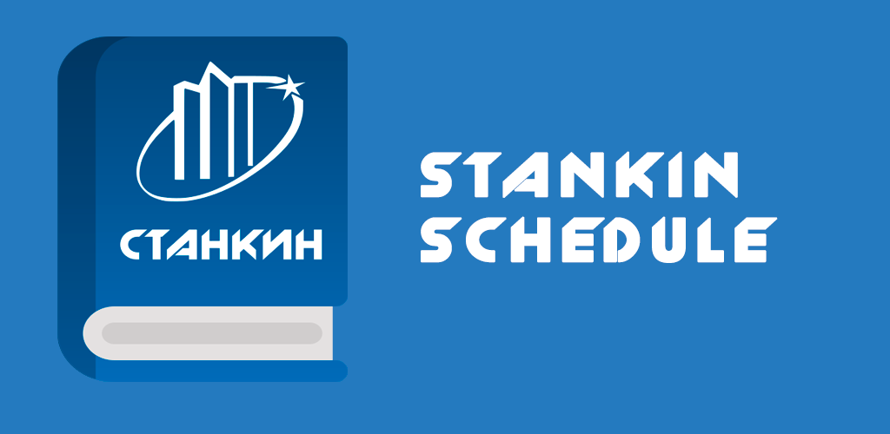
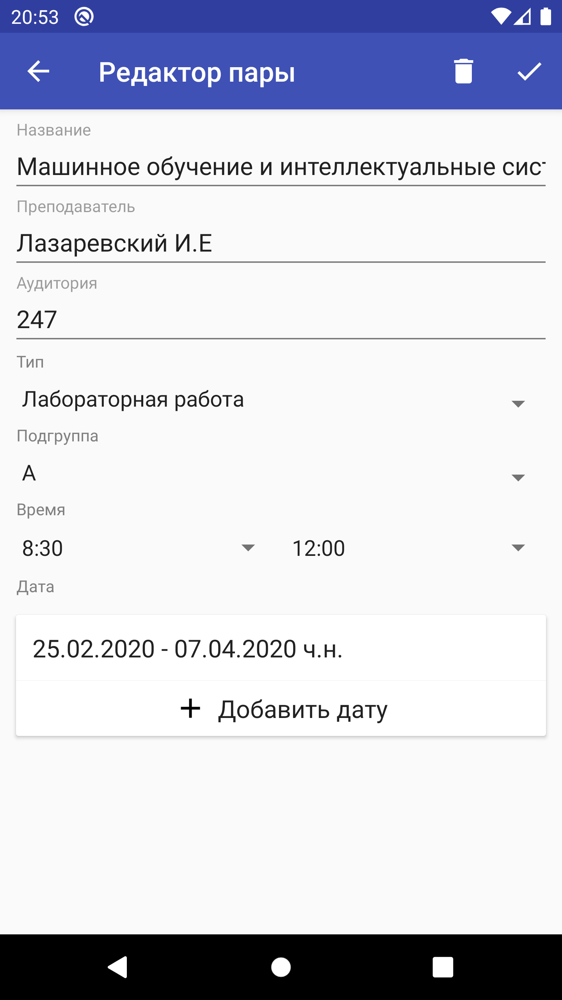
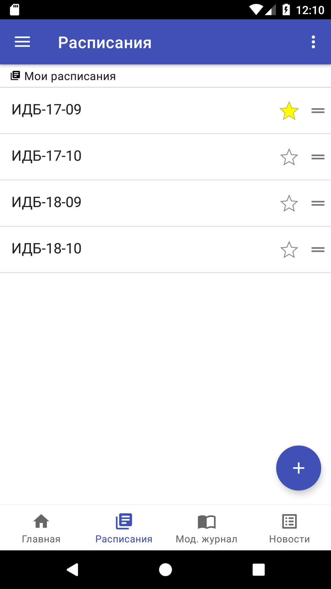
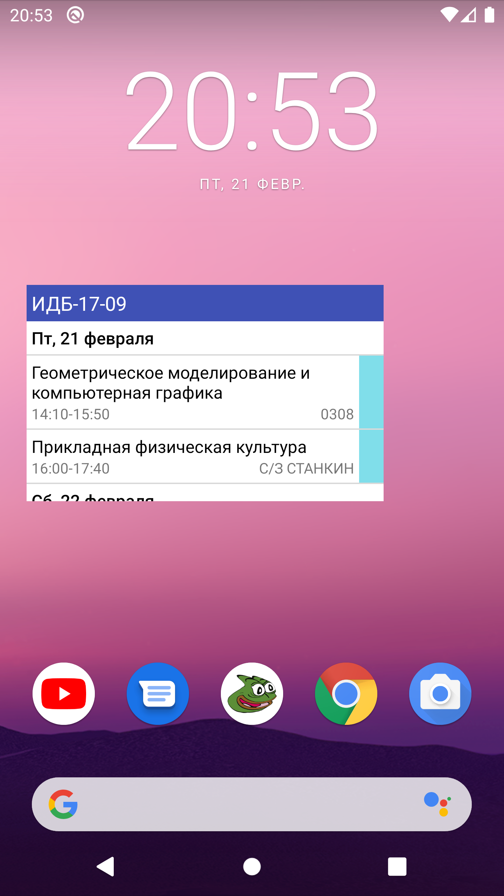

# Stankin Schedule (Project Pepega)

    

## Содержание

- [Описание](#Описание)
- [Загрузка](#Загрузка)
- [Особенности](#Особенности)
- [Скриншоты](#Скриншоты)

## Описание

Stankin Schedule (проект назывался Project Pepega изначально) - это не официальное приложение для
студентов МГТУ "СТАНКИН", в
котором можно: просматривать расписания, смотреть оценки модульного журнала и читать новости
университета.

## Загрузка

Последняя версия приложения: **2.1.0**

Google play store версия: **2.0.6**

Последняя Github beta-версия
приложения: [project-pepega-0.2.4.apk](https://github.com/Nikololoshka/ProjectPepega/releases/download/0.2.4/project-pepega-0.2.4.apk)

**Changelog**

[Файл со списком всех изменений](changelog.txt)

## Особенности

- [X] Расписание (создание, просмотр);
- [X] Виджет с расписанием;
- [X] Модульный журнал;
- [X] Новости университета и деканата;

## Скриншоты

| Главная страница                     | Просмотр расписания                  | Модульный журнал                     |
|--------------------------------------|--------------------------------------|--------------------------------------|
|  |  |  |

| Редактирование пары                  | Менеджер расписаний                  | Виджет с расписанием                 |
|--------------------------------------|--------------------------------------|--------------------------------------|
|  |  |  |
