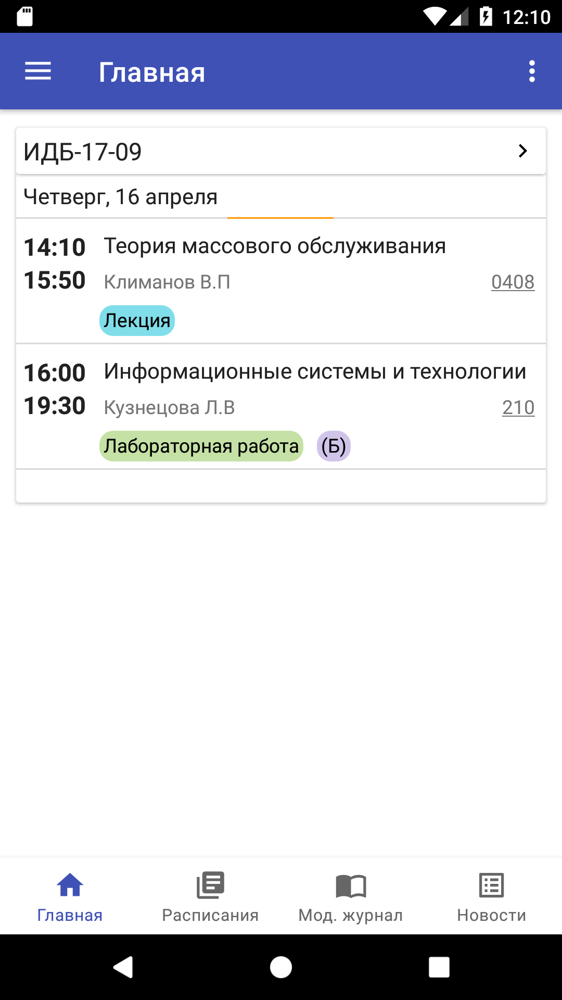
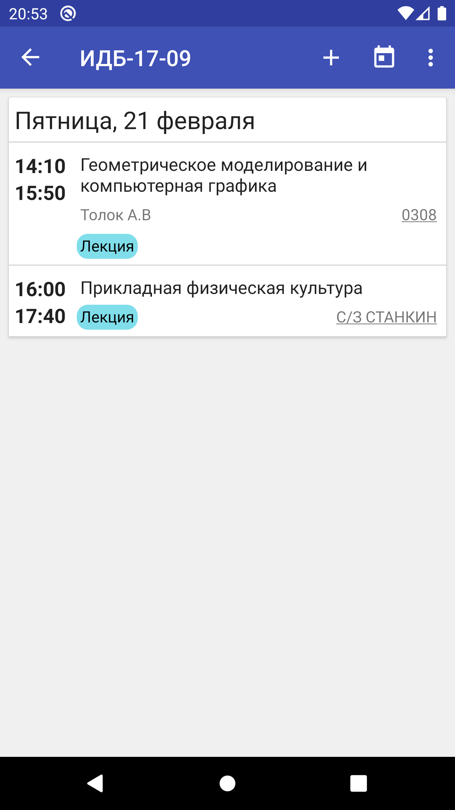
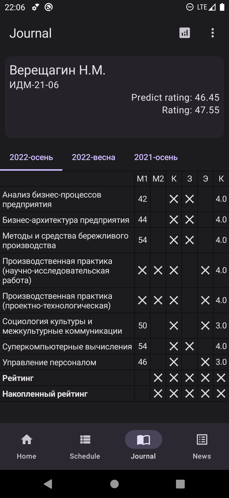

# ProjectPepega

#### Содержание

- [Описание](#Описание)
- [Особенности](#Особенности)
- [Скриншоты](#Скриншоты)

#### Описание

ProjectPepega (aka Stankin Schedule) - приложение разработанное для студентов МГТУ "СТАНКИН" для удобного и комфортного ведения расписания, просмотра модульного журнала и другого.

#### Особенности

- [X] Расписание (создание, просмотр);
- [X] Виджет с расписанием;
- [X] Модульный журнал;
- [ ] Новости университета и деканата;
- [ ] Карта университетеа;
- [ ] Справка по университету;

#### Скриншоты

